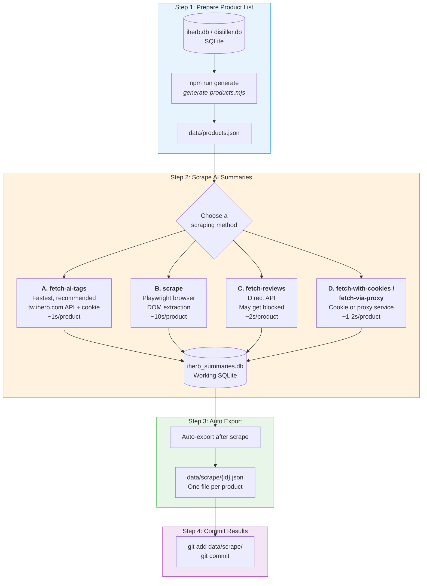
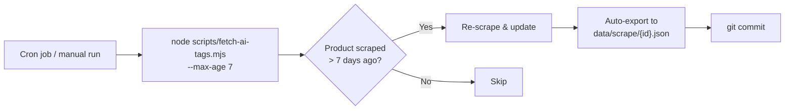

# iHerb AI Summary — Process Guide

## Overview

This project scrapes AI-generated review summaries ("What Customers Say") from iHerb product pages and stores them as per-product JSON files.

## Process Diagram



## Step-by-Step Guide

### Step 1: Generate Product List

Convert the SQLite database into a `products.json` file that the scrapers read.

```bash
# From iherb.db (default)
npm run generate

# With filters
node scripts/generate-products.mjs --min-reviews 5000 --limit 50

# From distiller.db (alternative source)
node scripts/generate-from-distiller.mjs --db /path/to/distiller.db
```

**Input:** `input/iherb.db` or `distiller.db` (SQLite)
**Output:** `data/products.json` — array of `{ id, url }` objects

---

### Step 2: Scrape AI Summaries

Pick one of the four scraping methods. They all read `products.json` and write results to the working database.

#### Method A: fetch-ai-tags (Recommended)

The fastest approach. Uses `tw.iherb.com` API with a static cookie.

```bash
node scripts/fetch-ai-tags.mjs                    # scrape all
node scripts/fetch-ai-tags.mjs --limit 100         # first 100 products
node scripts/fetch-ai-tags.mjs --concurrency 3     # parallel requests
node scripts/fetch-ai-tags.mjs --max-age 7         # re-scrape stale (>7 days)
node scripts/fetch-ai-tags.mjs --force              # re-scrape everything
```

Requires `IH_EXPERIMENT` env var or `.env` file.

#### Method B: scrape (Browser Automation)

Uses Playwright to open real browser pages. Slowest but most reliable against Cloudflare.

```bash
npm run scrape                # headless
npm run scrape:debug          # with visible browser window
node scripts/scrape.mjs --force
```

#### Method C: fetch-reviews (Direct API)

Calls `www.iherb.com/ugc/api` directly. Fast but may be blocked by Cloudflare.

```bash
npm run fetch
node scripts/fetch-reviews.mjs --limit 100
```

#### Method D: fetch-with-cookies / fetch-via-proxy

Uses browser cookies or proxy services (ScrapingBee, ScraperAPI) to bypass Cloudflare.

```bash
# With cookies (get from browser DevTools)
node scripts/fetch-with-cookies.mjs --cookies cookies.txt

# With proxy service
SCRAPING_API=scrapingbee SCRAPING_API_KEY=YOUR_KEY node scripts/fetch-via-proxy.mjs
```

#### Method Comparison

| Method | Speed | Reliability | Setup |
|--------|-------|------------|-------|
| **A. fetch-ai-tags** | ~1s/product | High | `.env` with cookie |
| **B. scrape** | ~10s/product | Highest | Playwright installed |
| **C. fetch-reviews** | ~2s/product | Low (403 blocks) | None |
| **D. cookies/proxy** | ~1-2s/product | Medium-High | Cookies or API key |

---

### Step 3: Auto Export

After each scrape run, results are **automatically exported** to individual JSON files:

```
data/scrape/
  ├── 62118.json
  ├── 86598.json
  ├── 103274.json
  └── ... (~10,000+ files)
```

Each file contains:

```json
{
  "iherb_id": 62118,
  "last_updated": "2026-03-20T09:15:19.574Z",
  "first_scraped": "2026-03-20T09:15:19.574Z",
  "source": "fetch-ai-tags",
  "data": {
    "summary": "Customers highlight: No fishy taste, ...",
    "tags": [
      { "name": "No fishy taste", "classification": 0, "count": 0 }
    ],
    "rating": null
  },
  "history": [
    { "scraped_at": "2026-03-20T09:15:19.574Z", "source": "fetch-ai-tags" }
  ]
}
```

To manually trigger export:
```bash
npm run export:scrape
```

---

### Step 4: Commit Results

The per-product JSON files in `data/scrape/` are git-tracked:

```bash
git add data/scrape/
git commit -m "Update AI summaries"
```

---

## Incremental Update Flow

For keeping data fresh, use `--max-age` to re-scrape products older than N days:



```bash
# Typical cron command
node scripts/fetch-ai-tags.mjs --max-age 7
```
